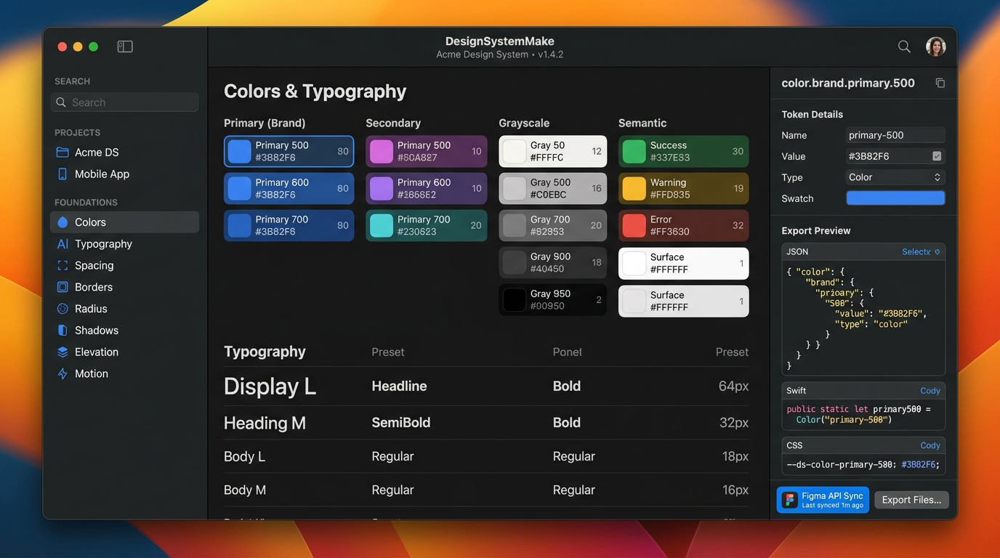

🇰🇷 [한국어](README.md) | 🇺🇸 [English](README.en.md) | 🇯🇵 [日本語](README.ja.md) | 🇨🇳 [中文](README.zh.md)

<p align="center">
  
</p>

<h1 align="center">🎨 DesignSystemMake</h1>

<p align="center">
  <b>macOS 네이티브 디자인 시스템 토큰 스튜디오 & 멀티 플랫폼 코드 내보내기</b><br/>
  SwiftUI 5, AppKit, W3C DTCG 표준 규격 및 Apple Human Interface Guidelines (HIG) 기반
</p>

<p align="center">
  
</p>

## 주요 기능

* **🎨 W3C DTCG 토큰 스튜디오**: 색상(Light/Dark 다크모드), 타이포그래피, 스페이싱, 라운딩, 그림자 관리
* **🍏 글로벌 표준 프리셋 제공**: Apple HIG, Tailwind CSS, Google Material Design 3, Ant Design
* **⚡ 멀티 플랫폼 코드 생성기**:
  * **iOS**: SwiftUI & UIKit (`UIColor`, `Color` 익스텐션)
  * **macOS**: SwiftUI & AppKit (`NSColor`, `Color` 익스텐션)
  * **Web**: Tailwind CSS `tailwind.config.js` 및 CSS Variables
  * **Android & Flutter**: Jetpack Compose & Dart 토큰 코드
* **⚡ Figma REST API 1-Click 동기화**: `POST /v1/files/{file_key}/variables`를 통한 직접 동기화
* **🤖 AI 에이전트 시스템 컨텍스트 내보내기**: Claude Code, Antigravity, Cursor 등 전용 `DESIGN_SYSTEM.md` 생성

## 설치 (Installation)

### Homebrew
```bash
brew tap mrKangHo/tap
brew install designsystemmake
```

또는 직접 저장소 탭 사용:
```bash
brew install mrKangHo/DesignSystemMake/designsystemmake
designsystemmake
```
